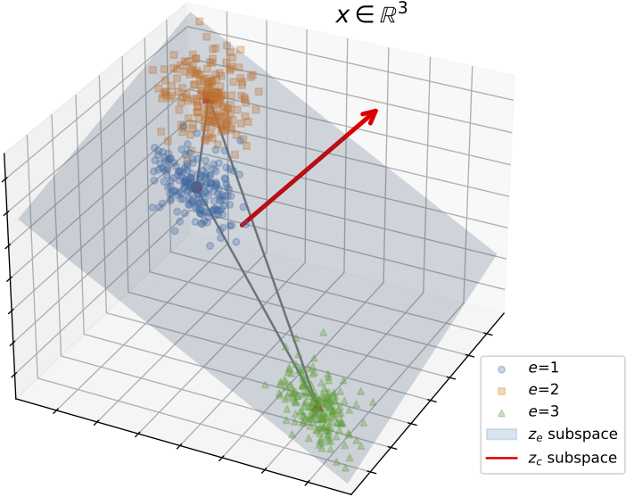
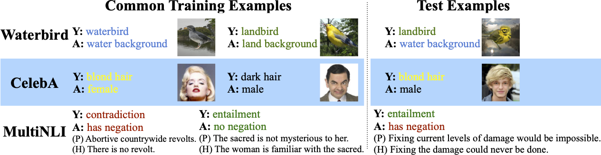

# Invariant-feature Subspace Recovery (ISR)
Code for the  paper **[Provable Domain Generalization via Invariant-Feature Subspace Recovery](https://arxiv.org/abs/2201.12919)** (ICML 2022) by Haoxiang Wang, Haozhe Si, Bo Li, and Han Zhao  from UIUC.

If you find this repo useful for your research, please consider citing our paper

```
@inproceedings{ISR,
  title = {Provable Domain Generalization via Invariant-Feature Subspace Recovery},
  author = {Wang, Haoxiang and Si, Haozhe and Li, Bo and Zhao, Han},
  booktitle = {International Conference on Machine Learning},
  pages = {23018--23033},
  year = {2022},
  publisher = {PMLR},
  url = {https://proceedings.mlr.press/v162/wang22x.html},
}
```


## Installation
This repo was tested with Ubuntu 20.04, Python 3.8/3.9 ([Anaconda](https://www.anaconda.com/products/individual) version), Pytorch 1.9/1.10/1.11 with CUDA 11. The experiments on the real datasets are tested on a single GPU of 16GB memory, but 11GB may also suffice.

Our code is devided into two parts, `linear_unit_tests/` and `real_datasets/`. 

+ `linear_unit_tests/`: This part is built on the [released code](https://github.com/facebookresearch/InvarianceUnitTests) of [Linear Unit-Tests](https://arxiv.org/abs/2102.10867). Please install necessary packages following their [installation requirements](https://github.com/facebookresearch/InvarianceUnitTests).
+ `real_datasets/`: This part is built on the [released code](https://github.com/kohpangwei/group_DRO) of [GroupDRO](https://arxiv.org/abs/1911.08731). Please also follow their [installation requirements](https://github.com/kohpangwei/group_DRO#prerequisites).

## Datasets

The synthetic datasets in `linear_unit_tests/` are generated by the code, and the three real datasets (Waterbirds, CelebA and MultiNLI) used in `real_datasets/` should be downloaded in advance following [this instruction](https://github.com/kohpangwei/group_DRO#datasets-and-code).



## Code

### `linear_unit_tests/`

Run `python launch_exp.py` to reproduce experiments in the paper. Use `python plot_results.py` to plot the results. The experiments on run on CPU (parallel on all CPU cores by default).

### `real_datasets/`

Run experiments on the three real-world datasets: 

+ `"CUB"`: The [Waterbirds](https://github.com/kohpangwei/group_DRO#waterbirds) dataset (a bird image dataset), formed from [Caltech-UCSD Birds 200](http://www.vision.caltech.edu/visipedia/CUB-200.html) + [Places](http://places2.csail.mit.edu/).
+ `"CelebA"`: The [CelebA](http://mmlab.ie.cuhk.edu.hk/projects/CelebA.html) dataset (a face image dataset).
+ `"MultiNLI"`: The [MultiNLI](https://www.nyu.edu/projects/bowman/multinli/) dataset (a text dataset).

Please see `real_datasets/README.md` for detailed instructions on running experiments.

Notably, we implement our ISR algorithms in a *sklearn*-style classifier class, which can be easily used as follows

```python
from isr import ISRClassifier
classifier = ISRClassifier(version="mean", # "mean": ISR-Mean. "cov": ISR-Cov.
                           d_spu=1, # the number of spurious features to remove
                          )
# xs: training samples
# ys: class labels
# es: environment labels
classifier.fit(xs,ys,es,
              chosen_class=0, # need to condition on a class
              )
predictions = classifier.predict(test_xs) # test_xs: test samples
```


## Acknowledgement
In this repo, we adopt some code from the following codebases, and we sincerely thank their authors:
+ [facebookresearch/InvarianceUnitTests](https://github.com/facebookresearch/InvarianceUnitTests): Our `/linear_unit_tests` is built upon this repo.
+ [kohpangwei/group_DRO](https://github.com/kohpangwei/group_DRO): Our `/real_datasets` is built on this repo.