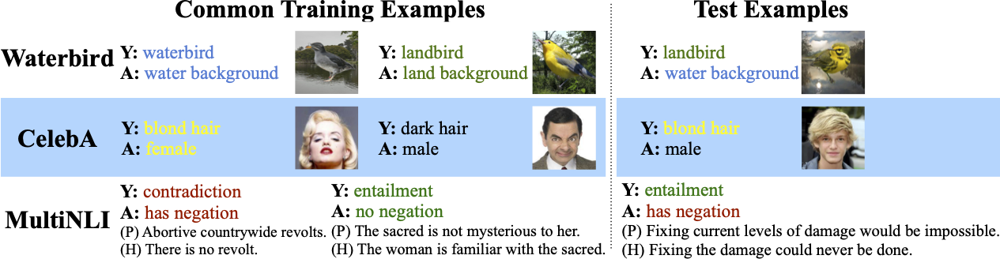

## Datasets

In this code repo, we use the following keywords to represent three real-world datasets:

+ `"CUB"`: The [Waterbirds](https://github.com/kohpangwei/group_DRO#waterbirds) dataset (a bird image dataset), formed from [Caltech-UCSD Birds 200](http://www.vision.caltech.edu/visipedia/CUB-200.html) + [Places](http://places2.csail.mit.edu/).
+ `"CelebA"`: The [CelebA](http://mmlab.ie.cuhk.edu.hk/projects/CelebA.html) dataset (a face image dataset).
+ `"MultiNLI"`: The [MultiNLI](https://www.nyu.edu/projects/bowman/multinli/) dataset (a text dataset).



## Preparation

+ Please download the datasets in to a folder and define the folder path as `DATA_FOLDER` in `configs/__init__.py` .
  - We expect the folder structure to be like:
  
    ```
    DATA_FOLDER
    └───waterbirds
    └───celebA_v1.0
    └───multinli
    ```
  
+ Please define `LOG_FOLDER` in ``configs/__init__.py`, which is the folder to save all training/evaluation results.

## Procedures

There are three procedures to run ISR-Mean/Cov on the real datasets.

#### 1. Train a neural network with ERM/Reweight/GroupDRO.

Can launch the training experiments with `python launch_train.py`.

#### 2. Parse learned features over training/validation/test data.

Parse learned features with `python launch_parse.py`, which save the parsed features locally.

#### 3. Post-process learned features & classifier with ISR-Mean/Cov

Run `eval.py` to evaluate with the vanilla trained classifier or the ISR classifiers. The evaluation results are saved in CSV files for analyses. [To-Do] You can also run `launch_eval.py` (automatially load the hyperparameters we used) to reproduce our experiment results reported in the paper.

## To-Do
- [ ] Implement `launch_eval.py` and fill in optimal hyperparameters (To reproduce Table 1 of our [paper](https://arxiv.org/pdf/2201.12919.pdf))
- [ ] Partial environment labels (To reproduce Figure 6 of our [paper](https://arxiv.org/pdf/2201.12919.pdf))
- [ ] ISR classifiers on CLIP backbones (To reproduce Table 2 of our [paper](https://arxiv.org/pdf/2201.12919.pdf))
- [ ] Provide trained models in a Dropbox folder